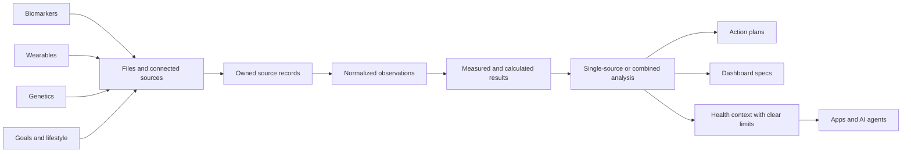

<h1 align="center">ForeverBetter API</h1>

<p align="center">
  <strong>Combine wearables, biomarkers, and genetics data into a interpreted, personalized dashboard and action plan built for you with your agent.</strong>
</p>

<p align="center">
  Upload biomarkers, genetics, and wearable observations. Analyze one source or combine them,<br />
  rank the next steps, and return results for your app, agent, or a ready-made ForeverBetter dashboard.
</p>

<p align="center">
  <a href="https://wellnizz.com"><strong>Website</strong></a> ·
  <a href="https://app.wellnizz.com/dashboard"><strong>Developer dashboard</strong></a> ·
  <a href="https://docs.wellnizz.com/api-reference/introduction"><strong>Documentation</strong></a> ·
  <a href="https://app.wellnizz.com/openapi.json"><strong>OpenAPI</strong></a> ·
  <a href="#self-hosting"><strong>Self-host</strong></a>
</p>

<p align="center">
  <a href="https://app.wellnizz.com/ready"></a>
  <a href="https://app.wellnizz.com/openapi.json"></a>
  <a href="https://docs.wellnizz.com/connect-your-agent"></a>
  <a href="LICENSE"></a>
</p>

## What can you build?

### Turn health data into a personalized dashboard and action plan

Upload biomarkers, genetics, or wearable observations. Analyze one source or combine them, get ranked next steps, and render the results in your own UI or with a ready-made ForeverBetter design.

<p align="center">
  <a href="assets/demos/multimodal-dashboard.mp4">
    
  </a>
</p>

<p align="center"><a href="assets/demos/multimodal-dashboard.mp4"><strong>Watch the full-quality dashboard flow</strong></a></p>

### Deliver a daily priority plan in chat

Give a scheduled agent a key limited to the user's approved data. It reads the latest health context and ranked action plan, then posts the day's brief to Telegram, WhatsApp, Slack, or your own app.

<p align="center">
  <a href="assets/demos/agent-daily-brief.mp4">
    
  </a>
</p>

<p align="center"><a href="assets/demos/agent-daily-brief.mp4"><strong>Watch the full-quality chat delivery flow</strong></a></p>

### Explore ancestry from genetic data

Upload whole-genome VCF/VCF.GZ or supported DNA test data. Return continental or regional ancestry with confidence, data coverage, and a plain explanation of how the result was produced.

<p align="center">
  <a href="assets/demos/ancestry-from-vcf.mp4">
    
  </a>
</p>

<p align="center"><a href="assets/demos/ancestry-from-vcf.mp4"><strong>Watch the full-quality ancestry flow</strong></a></p>

### Sync Google Health Connect readings directly

Send user-approved Android health readings directly into ForeverBetter with the mobile SDK. The API keeps when each reading happened, who it belongs to, and where it came from.

<p align="center">
  <a href="assets/demos/wearable-mobile-sync.mp4">
    
  </a>
</p>

<p align="center"><a href="assets/demos/wearable-mobile-sync.mp4"><strong>Watch the full-quality mobile sync flow</strong></a></p>

### Give apps and agents one health-data API

Use REST or MCP to upload data, connect providers, run analysis, create dashboards, and return action plans. Scoped keys limit what each app or agent can access. Hosted billing supports subscriptions and pay-per-request access.

<p align="center">
  <a href="assets/demos/wearable-data-console.mp4">
    
  </a>
</p>

<p align="center"><a href="assets/demos/wearable-data-console.mp4"><strong>Watch the full-quality developer surface</strong></a></p>

## Agent quickstart

The fastest onboarding is agent-led. Paste this into Claude, or into any agent that can call an HTTP API or speak MCP:

```text
Help me analyze and connect my longevity data.
Read https://app.wellnizz.com/SKILL.md and follow its onboarding instructions.
```

The skill file is the agent operating contract. Install it as a skill or paste it as a prompt; either way the agent runs the whole onboarding:

1. It reads the skill, then discovers the live surface with `GET /capabilities` and the agent manifest at `/.well-known/health-agent.json`.
2. It starts `POST /agent-login/start` and hands you a sign-in URL. You approve the named agent in your browser, and the API returns a scoped personal key once, directly to the waiting agent. No OTP, API key, or OAuth code ever passes through chat.
3. It connects the data you already have, runs the analysis, and delivers the outcome you asked for: an action plan, a custom dashboard, an ancestry breakdown, or a recurring daily brief like the chat flow above.

With the key in hand, the same API attaches to Claude over MCP:

```bash
claude mcp add --transport http foreverbetter \
  https://app.wellnizz.com/mcp \
  --header "Authorization: Bearer <api key>"
```

[Connect your agent](https://docs.wellnizz.com/connect-your-agent) covers the complete hosted-agent setup.

## Start building on the hosted API

### 1. Inspect the live platform

Discovery endpoints are public and reflect the configuration of the running deployment:

```bash
curl -s https://app.wellnizz.com/capabilities | jq .
curl -s https://app.wellnizz.com/design/systems | jq .
curl -s https://app.wellnizz.com/.well-known/health-agent.json | jq .
```

### 2. Create a developer key

Open the [developer dashboard](https://app.wellnizz.com/dashboard), sign in with the code sent to your email, and create a personal workspace key. An agent can instead start the explicit approval flow at `POST /agent-login/start`. Agent-login keys are shown once and do not include billing or account-deletion permissions.

```bash
export FB_API=https://app.wellnizz.com
export FB_KEY="your-api-key"
export USER_ID="your-user-id"
export ORGANIZATION_ID="your-workspace-id"
```

### 3. Upload biomarkers

```bash
SOURCE_ID=$(curl -s "$FB_API/imports/file" \
  -H "authorization: Bearer $FB_KEY" \
  -H "content-type: application/json" \
  -d '{
    "user_id": "'"$USER_ID"'",
    "organization_id": "'"$ORGANIZATION_ID"'",
    "category": "biomarkers",
    "filename": "labs.csv",
    "text": "marker,value,unit\nGlucose,92,mg/dL\nInsulin,7,uIU/mL\nTriglycerides,110,mg/dL\nHDL,55,mg/dL"
  }' | jq -r '.source.id')
```

### 4. Analyze and render

```bash
ANALYSIS_ID=$(curl -s "$FB_API/biomarkers/derive" \
  -H "authorization: Bearer $FB_KEY" \
  -H "content-type: application/json" \
  -d '{
    "user_id": "'"$USER_ID"'",
    "organization_id": "'"$ORGANIZATION_ID"'",
    "source_ids": ["'"$SOURCE_ID"'"]
  }' | jq -r '.id')

curl -s "$FB_API/analyses/$ANALYSIS_ID/action-plan" \
  -H "authorization: Bearer $FB_KEY" | jq .

curl -s "$FB_API/dashboard-specs/$ANALYSIS_ID" \
  -H "authorization: Bearer $FB_KEY" | jq .
```

## One flow across every data type



| Building block | What it represents |
| --- | --- |
| **Source** | A user-owned upload or provider sync, including when it was collected and where it came from. |
| **Observation** | A lab value, wearable metric, supplement, symptom, or other direct reading in a consistent format. |
| **Interpretation** | A scored status, calculated metric, genetic result, or combined finding. |
| **Analysis** | A run over one or more sources, from one data type or several together. |
| **Dashboard spec** | Versioned JSON your frontend can render into cards and sections, with freshness, data quality, coverage, and sources. |
| **Action plan** | Ranked next steps tied to the findings, supporting evidence, and suggested timing. |

One data type is still useful. Every response says what data was used, what is missing, and whether a result was measured, calculated, or combined.

## The three modality pipelines

Each modality keeps its raw source, normalized observations, interpretation, and
provenance. That lets a client show the result and the evidence behind it. A
single-modality analysis is valid on its own; a multimodal analysis adds the
available modalities and explicitly reports gaps.

### Biomarkers: measured labs → normalized values → derived physiology

The biomarker pipeline accepts CSV, JSON, plain text, and supported lab PDFs.
It canonicalizes marker names and units, applies age- and sex-aware ranges when
the profile supports them, scores direct measurements, and calculates only
metrics whose required inputs are present. Derived values retain their formula,
input markers, canonical unit, and `source_type: "derived"`.

The current marker catalog contains 168 definitions across:

- **Cardiometabolic:** ApoB, LDL-C, HDL-C, triglycerides, total cholesterol, non-HDL-C, Lp(a), ApoA1, ApoB/ApoA1 ratio, LDL and HDL particle number, small LDL particles, VLDL-C, remnant cholesterol, cholesterol/HDL, LDL/HDL, triglyceride/HDL, atherogenic coefficient, atherogenic index of plasma, oxidized LDL, and Lp-PLA2.
- **Glucose and insulin:** fasting glucose, fasting insulin, HbA1c, HOMA-IR, estimated average glucose, TyG index, C-peptide, fructosamine, glycated albumin, adiponectin, leptin, and ghrelin.
- **Inflammation and immune:** hs-CRP, ferritin, homocysteine, white blood cells, neutrophils, lymphocytes, ESR, IL-6, TNF-alpha, fibrinogen, neutrophil/lymphocyte ratio, platelet/lymphocyte ratio, systemic immune-inflammation index, systemic inflammation response index, myeloperoxidase, ANA titer, and rheumatoid factor.
- **Nutrient status:** vitamin D, B12, folate, magnesium, omega-3 index, uric acid, uric acid/HDL ratio, iron, TIBC, transferrin saturation, zinc, copper, selenium, vitamins A/E/B6, methylmalonic acid, and CoQ10.
- **Hormone and thyroid:** TSH, free and total T3, free T4, TSH/free T4 ratio, total and free testosterone, estradiol, SHBG, DHEA-S, morning cortisol, LH, FSH, prolactin, progesterone, IGF-1, IGF-1 Z score, TPO antibodies, thyroglobulin antibodies, total/free PSA, PSA % free, and AMH.
- **Organ function and safety:** ALT, AST, GGT, ALP, bilirubin, creatinine, eGFR, BUN, BUN/creatinine ratio, albumin, globulin, albumin/globulin ratio, sodium, potassium, chloride, CO2, calculated osmolality, calcium, corrected calcium, phosphorus, total protein, AST/ALT ratio, FIB-4, APRI, CRP/albumin ratio, fibrinogen/albumin ratio, cystatin C, urine albumin/creatinine, creatine kinase, LDH, and supported urinalysis fields including blood, protein, glucose, ketones, pH, specific gravity, cells, casts, bacteria, yeast, nitrite, leukocyte esterase, crystals, and bilirubin.
- **Hematology:** hemoglobin, hematocrit, red blood cells, platelets, RDW, MCV, MCH, MCHC, estimated MCHC, MPV, monocytes, eosinophils, basophils, reticulocyte count, and Mentzer index.

Common derived metrics include HOMA-IR, non-HDL-C, remnant cholesterol,
ApoB/ApoA1, transferrin saturation, VLDL-C, lipid ratios, estimated average
glucose, TyG, BUN/creatinine, CKD-EPI eGFR, calculated osmolality, corrected
calcium, globulin, albumin/globulin, AST/ALT, FIB-4, APRI, CRP/albumin,
fibrinogen/albumin, immune-cell ratios and indices, Mentzer index, estimated
MCHC, and TSH/free T4. Domain scores and a biological-age estimate are only
returned when the required measured inputs are available.

### Wearables: provider sync → canonical time series → recovery and load context

WHOOP and Oura use OAuth, refresh, named sync, and webhook reconciliation.
Google Health Connect is an on-device Android bridge: the user grants access in
the mobile app, which pushes selected records to the stable SDK endpoint. File
imports use the same normalized observation shape. The API preserves source,
timestamps, and collection windows before analyzing trends.

The wearable engine currently interprets 29 canonical signals:

- **Sleep and recovery:** sleep duration, sleep efficiency, sleep performance, deep sleep, light sleep, REM sleep, recovery/readiness score, sleep debt, and nap duration.
- **Cardiovascular recovery:** HRV, resting heart rate, average heart rate, respiratory rate, oxygen saturation, and skin temperature.
- **Activity and training:** maximum heart rate, daily steps, daily heart minutes, daily active minutes, Zone 2 minutes, vigorous minutes, workout count, strength sessions, VO2max estimate, and training strain.
- **Rhythm and consistency:** sleep consistency, bedtime variability, wake-time variability, and alcohol days.

Findings are interpreted against practical ranges and trends, then organized
into sleep/recovery, cardiovascular recovery, activity/training, and rhythm
domains. Wearable values are context, not a diagnosis; a short-term change is
shown with its source and window rather than treated as a permanent trait.

### Genetics: private genome → queued interpretation → bounded consumer context

Large VCF/VCF.GZ and SNP-array files use a direct private upload, are finalized
before analysis, and run as a queued job. The worker reports stages such as
annotation, genotype extraction, clinical interpretation, polygenic scoring,
consumer interpretation, persistence, and retry. Compact annotation uses the
bundled reference; full dbSNP is an explicit advanced worker mode. Results keep
the genome build, annotation depth, matched and missing variants, model
coverage, calculation state, reference details, and reanalysis recommendation.

The genetics pipeline has five user-facing interpretation layers:

1. **Clinical and medication context:** ClinVar findings and CPIC pharmacogenomics.
2. **Longevity and trait context:** curated genetic markers and the Genomic Longevity Index where the configured pipeline supports them.
3. **Polygenic health traits:** LDL cholesterol, HDL cholesterol, triglycerides, type 2 diabetes, BMI, coronary artery disease, chronic kidney disease, type 1 diabetes, obesity, kidney function/eGFR, celiac disease, and CRP/inflammation.
4. **Performance, sleep, and recovery context:** pulmonary function (FEV1/FVC), hand-grip strength, whole-body fat-free mass, walking duration, sleep duration, and chronotype. Measured phenotype and wearable data take precedence.
The compact consumer interpretation layer also exposes supported topics such as
caffeine clearance and sensitivity, aerobic trainability, power-versus-endurance
context, exercise tolerance, soft-tissue resilience, pulmonary function, sleep
duration, chronotype, grip strength, fat-free mass, and walking duration.

## How the modalities are fused and surfaced

Fusion happens after each source has been normalized and interpreted. The
analysis receives one or more source IDs, joins their observations by user and
workspace, and preserves each finding's source IDs, modality, engine, timestamp,
and source type (`direct`, `derived`, `combined`, `queued`, or `setup_required`).
The system then:

1. Computes modality and domain findings, excluding unavailable or unverified data from aggregate scores.
2. Uses the available findings, goals, symptoms, medications, supplements, lifestyle, and prior analyses to prioritize next steps. Missing modalities remain visible as coverage gaps; they do not make the available data unusable.
3. Returns an analysis summary with top findings, optional healthspan/domain scores, and a dashboard spec containing cards, sections, freshness, quality, coverage, target ranges, confidence, and provenance.
4. Makes the same bounded context queryable through REST and MCP, and renders it into a private dashboard or client-owned UI. Action plans link recommendations back to the findings and evidence that triggered them.

This is evidence-weighted context, not an opaque “all data” score: direct
measurements outrank derived values, measured phenotype outranks genetic tendency,
and a result is labeled as partial, stale, setup-required, or unavailable when
that is the honest state.

## Supported capabilities

| Data type | Inputs and connections | Outputs |
| --- | --- | --- |
| **Biomarkers** | CSV, JSON, plain text, and supported lab PDFs | Direct values, unit-aware ranges, derived biomarkers, interpretations, trends, and action priorities |
| **Wearables** | WHOOP OAuth, Oura OAuth, Google Health Connect mobile bridge, and normalized file import | Sleep, HRV, heart rate, readiness, activity, SpO2, energy, body composition, and other normalized observations |
| **Genetics** | Private whole-genome VCF/VCF.GZ upload and supported DNA test exports | Health and trait context, ancestry, maternal and paternal lineages, medication-response context, job status, and reference details |
| **Health context** | Goals, symptoms, medications, supplements, lifestyle, user notes, and existing analyses | Combined context with clear safety limits for products and agents |
| **Provider discovery** | Modality, provider type, and region filters | Lab locator handoffs, wearable capabilities, and genetic testing or WGS provider records |

Use `GET /capabilities` as the runtime source of truth. Full dbSNP analysis is an advanced worker mode that requires a persistent 30 to 40 GB reference cache per genome build. The API reports `available` or `requires_setup` instead of pretending it is configured.

## Built for agents with clear permissions

ForeverBetter exposes the same health data and actions through REST and 21 MCP tools. Each agent is tied to a user and workspace, with explicit limits on the data and endpoints it can access. The browser approval flow names the requesting agent, requires an explicit approve or deny, and returns the API key only once.

Examples of questions an agent can answer:

```text
What changed since my last biomarker panel?
Which recovery signals are trending down this week?
Which findings are direct measurements and which are derived?
Show the source and timestamp behind this dashboard card.
Build me a custom action plan & dashboard.
Add to OpenClaw or Hermes Agent to ping me on a daily basis with my dashboard and top priorities for the day.
Export everything this agent is allowed to access for this user.
```

For daily delivery, the agent should use a user-approved scoped key, read the latest health context and action plan, generate or reuse a private dashboard link, and schedule the notification in the user's OpenClaw or Hermes environment. ForeverBetter supplies the health data and scoped key. The agent runtime owns the schedule and delivery channel.

Start with [Connect your agent](https://docs.wellnizz.com/connect-your-agent), inspect the [agent manifest](https://app.wellnizz.com/.well-known/health-agent.json), or call `POST /mcp` with `tools/list`.

## Design systems are API features

`GET /design/systems` returns three ready-made UI systems for health products. Each includes colors, type, spacing, motion, responsive layouts, dashboard sections, action-plan structure, data requirements, and a ready-to-use `DESIGN.md`.

| ID | Structure | Best for |
| --- | --- | --- |
| `foreverbetter` | Editorial healthspan dossier | Full multimodal longevity reports |
| `aperture` | Calm daily health overview | Consumer coaching, health pillars, and source-aware records |
| `meridian` | Healthspan performance workspace | Agent-built wearable dashboards |

```bash
curl -s "$FB_API/design/systems/aperture" | jq .
curl -s "$FB_API/design/systems/aperture/implementation" > aperture-handoff.json
curl -s "$FB_API/design/systems/meridian/implementation" > meridian-handoff.json
```

The Aperture and Meridian implementation endpoints return complete design-system handoffs: source components, tokens, templates, UI-kit starting points, manifests, checksums, and URLs for included binary assets. Every source file is also available at `/design-system-specs/{id}/...`. Meridian additionally includes its pinned production dashboard package and API bindings. UI-kit health values are illustrative; a client must bind them to the user's scoped ForeverBetter data or render the supplied connection state.

## API structure

The source of truth is [`src/endpoints.ts`](src/endpoints.ts), which defines 48 endpoint capabilities and their required scopes. The HTTP layer also exposes public auth, discovery, dashboard, provider-webhook, health, version, OpenAPI, MCP, and payment-discovery routes. Core REST routes accept a `/v1/` alias, while the mobile SDK keeps its stable `/api/v1/` path.

| Area | Representative endpoints |
| --- | --- |
| Discover | `GET /capabilities`, `GET /providers`, `GET /pricing`, `GET /design/systems` |
| Authenticate | `POST /auth/otp/start`, `POST /auth/otp/verify`, `POST /agent-login/start`, `POST /api-keys` |
| Import | `POST /imports/file`, `POST /genetics/uploads`, `POST /genetics/uploads/{id}/complete`, mobile SDK sync |
| Connect | Wearable start, callback, status, WHOOP/Oura sync and refresh, provider webhooks |
| Analyze | Biomarker, wearable, genetics, ancestry, multimodal analysis, rerun, and job status |
| Act | Recommendations, action plans, goals, trends, and retest reminders |
| Render | Dashboard specs, private snapshot links, and full Aperture/Meridian design-system handoffs |
| Query | Unified health context, grounded query, REST, and MCP |
| Govern | Export, deletion, webhook events, API keys, billing status, and admin readiness |

Machine-readable surfaces:

- OpenAPI 3.1: `GET /openapi.json`
- endpoint catalog: `GET /endpoints`
- agent discovery: `GET /.well-known/health-agent.json`
- x402 discovery: `GET /.well-known/x402.json`
- MCP: `POST /mcp`
- public readiness: `GET /ready`
- authenticated diagnostics: `GET /ready/details` with `health:admin`

## Payment options

Stripe subscriptions and x402 pay-per-use payments are available.

## Development and verification

```bash
npm ci
git config core.hooksPath .githooks
npm run typecheck
npm run build
npm test
npm run skill:verify
npm run package:verify
npm audit --omit=dev
docker compose config --quiet
```

PostgreSQL store tests run when `TEST_DATABASE_URL` is set. The scheduled readiness workflow runs the build, tests, skill verification, package verification, docs validation, dependency audit, and Compose validation. GitHub Actions are pinned to reviewed full commit SHAs.

## License

AGPL-3.0-only. See [`LICENSE`](LICENSE).

---

<p align="center">
  <strong>Build personalized health products with results users can understand and sources they can inspect.</strong>
</p>

<p align="center">
  <a href="https://app.wellnizz.com/dashboard">Create a developer key</a> ·
  <a href="#self-hosting">Run it locally</a> ·
  <a href="https://app.wellnizz.com/openapi.json">Download OpenAPI</a>
</p>

<sub>ForeverBetter provides health-data and educational infrastructure. It is not medical advice and is not intended for diagnosis, treatment, or emergencies.</sub>

## Self-hosting

To run the ForeverBetter API on your own infrastructure, clone this repository, copy `.env.example` to `.env`, replace every `change-me` value with an independent secret, and start the included PostgreSQL, API, genetics-worker, and wearable-worker stack with `docker compose up -d`; see [`SELF_HOSTING.md`](SELF_HOSTING.md) for storage, authentication, TLS, provider credentials, backups, upgrades, and production guidance.
