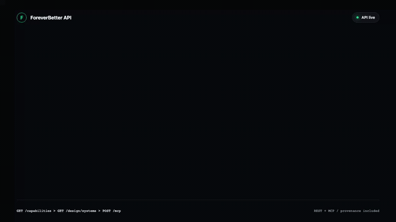
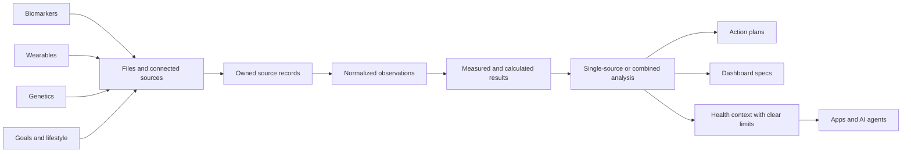

<h1 align="center">ForeverBetter API</h1>

<p align="center">
  <strong>Turn health data into personalized results and a clear action plan.</strong>
</p>

<p align="center">
  Upload biomarkers, genetics, and wearable observations. Analyze one source or combine them,<br />
  rank the next steps, and return results for your app, agent, or a ready-made ForeverBetter dashboard.
</p>

<p align="center">
  <a href="https://foreverbetter.xyz"><strong>Website</strong></a> ·
  <a href="https://api.foreverbetter.xyz/dashboard"><strong>Developer dashboard</strong></a> ·
  <a href="https://foreverbetter.mintlify.app/api-reference/introduction"><strong>Documentation</strong></a> ·
  <a href="https://api.foreverbetter.xyz/openapi.json"><strong>OpenAPI</strong></a> ·
  <a href="#run-it-yourself"><strong>Self-host</strong></a>
</p>

<p align="center">
  <a href="https://api.foreverbetter.xyz/ready"></a>
  <a href="https://api.foreverbetter.xyz/openapi.json"></a>
  <a href="https://foreverbetter.mintlify.app/connect-your-agent"></a>
  <a href="LICENSE"></a>
</p>

## What can you build?

### Turn health data into a personalized dashboard and action plan

Upload biomarkers, genetics, or wearable observations. Analyze one source or combine them, get ranked next steps, and render the results in your own UI or with a ready-made ForeverBetter design.

<p align="center">
  <a href="assets/demos/multimodal-dashboard.mp4">
    
  </a>
</p>

<p align="center"><a href="assets/demos/multimodal-dashboard.mp4"><strong>Watch the full-quality dashboard flow</strong></a></p>

### Deliver a daily priority plan in chat

Give a scheduled agent a key limited to the user's approved data. It reads the latest health context and ranked action plan, then posts the day's brief to Telegram, WhatsApp, Slack, or your own app.

<p align="center">
  <a href="assets/demos/agent-daily-brief.mp4">
    
  </a>
</p>

<p align="center"><a href="assets/demos/agent-daily-brief.mp4"><strong>Watch the full-quality chat delivery flow</strong></a></p>

### Explore ancestry from genetic data

Upload whole-genome VCF/VCF.GZ or supported DNA test data. Return continental or regional ancestry with confidence, data coverage, and a plain explanation of how the result was produced.

<p align="center">
  <a href="assets/demos/ancestry-from-vcf.mp4">
    
  </a>
</p>

<p align="center"><a href="assets/demos/ancestry-from-vcf.mp4"><strong>Watch the full-quality ancestry flow</strong></a></p>

### Sync Google Health Connect readings directly

Send user-approved Android health readings directly into ForeverBetter with the mobile SDK. The API keeps when each reading happened, who it belongs to, and where it came from.

<p align="center">
  <a href="assets/demos/wearable-mobile-sync.mp4">
    
  </a>
</p>

<p align="center"><a href="assets/demos/wearable-mobile-sync.mp4"><strong>Watch the full-quality mobile sync flow</strong></a></p>

### Give apps and agents one health-data API

Use REST or MCP to upload data, connect providers, run analysis, create dashboards, and return action plans. Scoped keys limit what each app or agent can access. Hosted billing supports subscriptions and pay-per-request access.

<p align="center">
  <a href="assets/demos/wearable-data-console.mp4">
    
  </a>
</p>

<p align="center"><a href="assets/demos/wearable-data-console.mp4"><strong>Watch the full-quality developer surface</strong></a></p>

## Agent quickstart

The fastest onboarding is agent-led. Paste this into Claude, or into any agent that can call an HTTP API or speak MCP:

```text
Help me analyze and connect my longevity data.
Read https://api.foreverbetter.xyz/SKILL.md and follow its onboarding instructions.
```

The skill file is the agent operating contract. Install it as a skill or paste it as a prompt; either way the agent runs the whole onboarding:

1. It reads the skill, then discovers the live surface with `GET /capabilities` and the agent manifest at `/.well-known/health-agent.json`.
2. It starts `POST /agent-login/start` and hands you a sign-in URL. You approve the named agent in your browser, and the API returns a scoped personal key once, directly to the waiting agent. No OTP, API key, or OAuth code ever passes through chat.
3. It connects the data you already have, runs the analysis, and delivers the outcome you asked for: an action plan, a custom dashboard, an ancestry breakdown, or a recurring daily brief like the chat flow above.

With the key in hand, the same API attaches to Claude over MCP:

```bash
claude mcp add --transport http foreverbetter \
  https://api.foreverbetter.xyz/mcp \
  --header "Authorization: Bearer <api key>"
```

[Connect your agent](https://foreverbetter.mintlify.app/connect-your-agent) covers the same skill in local pipeline mode and against a self-hosted deployment.

## Start building on the hosted API

### 1. Inspect the live platform

Discovery endpoints are public and reflect the configuration of the running deployment:

```bash
curl -s https://api.foreverbetter.xyz/capabilities | jq .
curl -s https://api.foreverbetter.xyz/design/systems | jq .
curl -s https://api.foreverbetter.xyz/.well-known/health-agent.json | jq .
```

### 2. Create a developer key

Open the [developer dashboard](https://api.foreverbetter.xyz/dashboard), sign in with the code sent to your email, and create a personal workspace key. An agent can instead start the explicit approval flow at `POST /agent-login/start`. Agent-login keys are shown once and do not include billing or account-deletion permissions.

```bash
export FB_API=https://api.foreverbetter.xyz
export FB_KEY="your-api-key"
export USER_ID="your-user-id"
export ORGANIZATION_ID="your-workspace-id"
```

### 3. Upload biomarkers

```bash
SOURCE_ID=$(curl -s "$FB_API/imports/file" \
  -H "authorization: Bearer $FB_KEY" \
  -H "content-type: application/json" \
  -d '{
    "user_id": "'"$USER_ID"'",
    "organization_id": "'"$ORGANIZATION_ID"'",
    "category": "biomarkers",
    "filename": "labs.csv",
    "text": "marker,value,unit\nGlucose,92,mg/dL\nInsulin,7,uIU/mL\nTriglycerides,110,mg/dL\nHDL,55,mg/dL"
  }' | jq -r '.source.id')
```

### 4. Analyze and render

```bash
ANALYSIS_ID=$(curl -s "$FB_API/biomarkers/derive" \
  -H "authorization: Bearer $FB_KEY" \
  -H "content-type: application/json" \
  -d '{
    "user_id": "'"$USER_ID"'",
    "organization_id": "'"$ORGANIZATION_ID"'",
    "source_ids": ["'"$SOURCE_ID"'"]
  }' | jq -r '.id')

curl -s "$FB_API/analyses/$ANALYSIS_ID/action-plan" \
  -H "authorization: Bearer $FB_KEY" | jq .

curl -s "$FB_API/dashboard-specs/$ANALYSIS_ID" \
  -H "authorization: Bearer $FB_KEY" | jq .
```

## One flow across every data type



| Building block | What it represents |
| --- | --- |
| **Source** | A user-owned upload or provider sync, including when it was collected and where it came from. |
| **Observation** | A lab value, wearable metric, supplement, symptom, or other direct reading in a consistent format. |
| **Interpretation** | A scored status, calculated metric, genetic result, or combined finding. |
| **Analysis** | A run over one or more sources, from one data type or several together. |
| **Dashboard spec** | Versioned JSON your frontend can render into cards and sections, with freshness, data quality, coverage, and sources. |
| **Action plan** | Ranked next steps tied to the findings, supporting evidence, and suggested timing. |

One data type is still useful. Every response says what data was used, what is missing, and whether a result was measured, calculated, or combined.

## Supported capabilities

| Data type | Inputs and connections | Outputs |
| --- | --- | --- |
| **Biomarkers** | CSV, JSON, plain text, and supported lab PDFs | Direct values, unit-aware ranges, derived biomarkers, interpretations, trends, and action priorities |
| **Wearables** | WHOOP OAuth, Oura OAuth, Google Health Connect mobile bridge, and normalized file import | Sleep, HRV, heart rate, readiness, activity, SpO2, energy, body composition, and other normalized observations |
| **Genetics** | Private whole-genome VCF/VCF.GZ upload and supported DNA test exports | Health and trait context, ancestry, maternal and paternal lineages, medication-response context, job status, and reference details |
| **Health context** | Goals, symptoms, medications, supplements, lifestyle, user notes, and existing analyses | Combined context with clear safety limits for products and agents |
| **Provider discovery** | Modality, provider type, and region filters | Lab locator handoffs, wearable capabilities, and genetic testing or WGS provider records |

Use `GET /capabilities` as the runtime source of truth. Full dbSNP analysis is an advanced worker mode that requires a persistent 30 to 40 GB reference cache per genome build. The API reports `available` or `requires_setup` instead of pretending it is configured.

## Built for agents with clear permissions

ForeverBetter exposes the same health data and actions through REST and 21 MCP tools. Each agent is tied to a user and workspace, with explicit limits on the data and endpoints it can access. The browser approval flow names the requesting agent, requires an explicit approve or deny, and returns the API key only once.

Examples of questions an agent can answer:

```text
What changed since my last biomarker panel?
Which recovery signals are trending down this week?
Which findings are direct measurements and which are derived?
Show the source and timestamp behind this dashboard card.
Build me a custom action plan & dashboard.
Add to OpenClaw or Hermes Agent to ping me on a daily basis with my dashboard and top priorities for the day.
Export everything this agent is allowed to access for this user.
```

For daily delivery, the agent should use a user-approved scoped key, read the latest health context and action plan, generate or reuse a private dashboard link, and schedule the notification in the user's OpenClaw or Hermes environment. ForeverBetter supplies the health data and scoped key. The agent runtime owns the schedule and delivery channel.

Start with [Connect your agent](https://foreverbetter.mintlify.app/connect-your-agent), inspect the [agent manifest](https://api.foreverbetter.xyz/.well-known/health-agent.json), or call `POST /mcp` with `tools/list`.

## Design systems are API features

`GET /design/systems` returns three ready-made UI systems for health products. Each includes colors, type, spacing, motion, responsive layouts, dashboard sections, action-plan structure, data requirements, and a ready-to-use `DESIGN.md`.

| ID | Structure | Best for |
| --- | --- | --- |
| `foreverbetter` | Editorial healthspan dossier | Full multimodal longevity reports |
| `aperture` | Calm daily health overview | Consumer coaching, health pillars, and source-aware records |
| `meridian` | Healthspan performance workspace | Agent-built wearable dashboards |

```bash
curl -s "$FB_API/design/systems/aperture" | jq .
curl -s "$FB_API/design/systems/meridian/implementation" > meridian-dashboard.json
```

The Meridian implementation endpoint returns production HTML, CSS, JavaScript, assets, and API bindings. ForeverBetter and Aperture return reusable colors, type, spacing, layouts, and required data fields, so a client can build a distinct UI without losing source details or action-plan content.

## API structure

The source of truth is [`src/endpoints.ts`](src/endpoints.ts), which defines 48 endpoint capabilities and their required scopes. The HTTP layer also exposes public auth, discovery, dashboard, provider-webhook, health, version, OpenAPI, MCP, and payment-discovery routes. Core REST routes accept a `/v1/` alias, while the mobile SDK keeps its stable `/api/v1/` path.

| Area | Representative endpoints |
| --- | --- |
| Discover | `GET /capabilities`, `GET /providers`, `GET /pricing`, `GET /design/systems` |
| Authenticate | `POST /auth/otp/start`, `POST /auth/otp/verify`, `POST /agent-login/start`, `POST /api-keys` |
| Import | `POST /imports/file`, `POST /genetics/uploads`, `POST /genetics/uploads/{id}/complete`, mobile SDK sync |
| Connect | Wearable start, callback, status, WHOOP/Oura sync and refresh, provider webhooks |
| Analyze | Biomarker, wearable, genetics, ancestry, multimodal analysis, rerun, and job status |
| Act | Recommendations, action plans, goals, trends, and retest reminders |
| Render | Dashboard specs, private snapshot links, design systems, and the Meridian implementation contract |
| Query | Unified health context, grounded query, REST, and MCP |
| Govern | Export, deletion, webhook events, API keys, billing status, and admin readiness |

Machine-readable surfaces:

- OpenAPI 3.1: `GET /openapi.json`
- endpoint catalog: `GET /endpoints`
- agent discovery: `GET /.well-known/health-agent.json`
- x402 discovery: `GET /.well-known/x402.json`
- MCP: `POST /mcp`
- public readiness: `GET /ready`
- authenticated diagnostics: `GET /ready/details` with `health:admin`

## Payment options

Stripe subscriptions and x402 pay-per-use payments are available.

## Run it yourself

### Prerequisites

- Docker Engine with Docker Compose v2
- `openssl` for generating secrets
- 2 GB or more of disk for the base image and additional storage for Postgres and uploaded payloads
- a domain and TLS reverse proxy for any internet-facing deployment
- additional persistent storage for full dbSNP mode

### Local Docker Compose

```bash
git clone https://github.com/liveforeverbetter/foreverbetter.git
cd foreverbetter
cp .env.example .env
```

Edit `.env` and replace every `change-me` value. Generate independent secrets:

```bash
openssl rand -hex 32   # POSTGRES_PASSWORD
openssl rand -hex 32   # API_KEY_JWT_SECRET
openssl rand -hex 32   # SERVICE_ACCOUNT_JWT_SECRET
openssl rand -hex 32   # AUDIT_IP_HASH_SALT
```

The production example defaults email login off. Start the stack and mint the first operator key:

```bash
docker compose up -d
curl http://localhost:8787/ready

docker compose exec api node scripts/mint-api-key.mjs \
  --out - --user you --org your-org --scope "health:admin"
```

The minimal stack starts PostgreSQL, the API, the genetics worker, and the wearable worker. Raw payloads use the shared Docker volume by default. The API container applies migrations on boot.

Optional local-only profiles:

```bash
# Local SMTP inbox. Set EMAIL_DRIVER=smtp, SMTP_HOST=mailpit, SMTP_PORT=1025.
docker compose --profile mail up -d
# UI is loopback-only at http://127.0.0.1:8025

# Local S3-compatible storage. Set unique S3_ACCESS_KEY_ID and S3_SECRET_ACCESS_KEY first.
docker compose --profile s3 up -d
# MinIO API and console are loopback-only by default.
```

Do not expose Mailpit or the MinIO console to the internet. Compose requires an explicit PostgreSQL password and explicit MinIO credentials. Local secret files should be mode `0600`.

For a database outside Compose, set `DATABASE_SSL=require`. Certificate verification is on. If the database uses a private CA, set `DATABASE_SSL_CA` to its PEM text with newlines encoded as `\n`.

### Run from source without Docker

For a disposable local process with no database:

```bash
npm ci
npm run build
STORE_MODE=memory AUTH_MODE=disabled EMAIL_DRIVER=none NODE_ENV=development npm start
```

For production from source, use PostgreSQL 16, durable payload storage, `AUTH_MODE=service_account` or `oidc`, verified TLS, and separate API and worker processes:

```bash
npm ci
npm run build
npm run migrate
npm start
node dist/workers/wearables-worker.js
node dist/workers/genetics-worker.js
```

The Docker image includes `bcftools`, `tabix`, and the pinned TypeScript runtime needed by the bundled genetics pipeline.

[`SELF_HOSTING.md`](SELF_HOSTING.md) covers storage drivers, email sign-in, wearable credentials, backups, and upgrades.

## Development and verification

```bash
npm ci
git config core.hooksPath .githooks
npm run typecheck
npm run build
npm test
npm run skill:verify
npm run package:verify
npm audit --omit=dev
docker compose config --quiet
```

PostgreSQL store tests run when `TEST_DATABASE_URL` is set. The scheduled readiness workflow runs the build, tests, skill verification, package verification, docs validation, dependency audit, and Compose validation. GitHub Actions are pinned to reviewed full commit SHAs.

## License

AGPL-3.0-only. See [`LICENSE`](LICENSE).

---

<p align="center">
  <strong>Build personalized health products with results users can understand and sources they can inspect.</strong>
</p>

<p align="center">
  <a href="https://api.foreverbetter.xyz/dashboard">Create a developer key</a> ·
  <a href="#run-it-yourself">Run it locally</a> ·
  <a href="https://api.foreverbetter.xyz/openapi.json">Download OpenAPI</a>
</p>

<sub>ForeverBetter provides health-data and educational infrastructure. It is not medical advice and is not intended for diagnosis, treatment, or emergencies.</sub>
